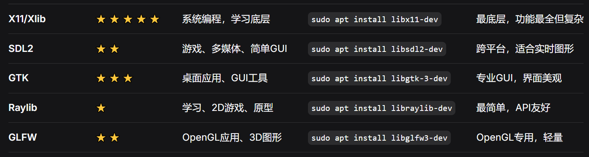

# F1 Racing Car


地图褶皱            ✔️

切换汽车模型  ✔️

地图差一张    ✔️

菜单页面, 主页面

多线程不冲键    ✔️

最后把多余注释去掉, 只留操作说明 ✔️

不出公路, 赛车边界   ✔️

空格有氮气加速   道具

有对面来的汽车  ✔️

汽车速度太快  ✔️

碰撞之后的事情  ✔️

过场动画修复一下  ✔️

bgm 剪辑一下, 只要高潮

积分  ✔️

血条包在黑框里, 去掉血条下面的显示  ✔️

# 窗口选择

### 如果你是初学者：用 Raylib

- 最简单，函数名直观
- 内置绘图函数丰富
- 适合学习图形编程基础

### 想做游戏：用 SDL2

- 游戏行业标准
- 跨平台（Windows/Linux/macOS）
- 多媒体支持好（声音、手柄等）

### 想做桌面应用：用 GTK

- 专业GUI工具包
- 控件丰富（按钮、输入框、菜单等）
- 界面美观

### 想学习底层：用 X11

- 理解Linux图形系统原理
- 最接近操作系统



选择 SDL2 作为窗口

```shell
sudo apt update
# 安装 SDL2 开发库
sudo apt install libsdl2-dev -y
# 安装 SDL2 支持 png 图片渲染
sudo apt install libsdl2-image-dev -y
# bgm 音乐支持
sudo apt install libsdl2-mixer-dev -y
# 字体支持
sudo apt install libsdl2-ttf-dev -y
```


